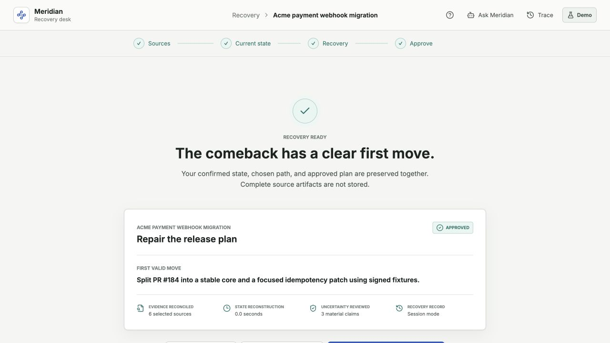
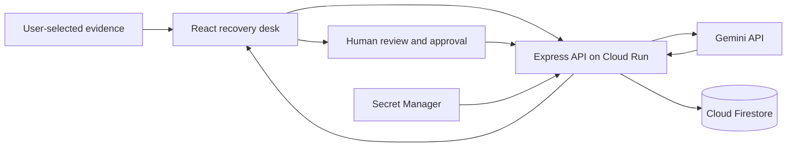

# Meridian

**An evidence-grounded recovery companion for plans that stopped matching reality.**

[Live application](https://meridian-1058381544422.asia-south1.run.app) | Built for the Vibe2Ship hackathon's **The Last-Minute Life Saver** challenge

Most productivity tools help people create a plan. Meridian owns the more neglected moment after that plan breaks: it reconstructs what is true across fragmented sources, makes uncertainty visible, compares valid recovery paths, and helps the user approve one executable next move.



## The Workflow

1. **Bring the evidence** - select emails, chats, tickets, notes, CI results, or calendar context for one disrupted commitment.
2. **Reconstruct current state** - Gemini extracts the commitment, changed scope, valid progress, blockers, timing, contradictions, and unknowns with source links.
3. **Review uncertainty** - the user confirms, corrects, rejects, or preserves inferred, conflicting, and missing claims.
4. **Choose recovery** - compare repair, deliberate delay, rebuild, drop, and renegotiate by evidence, consequence, and authority.
5. **Approve the comeback** - edit a locally executable first move and optional stakeholder update before recording the decision.

The included hero case follows a software engineer recovering an at-risk client webhook migration whose state is split across Gmail, Slack, GitHub, Linear, CI, and Google Calendar artifacts.

## Key Features

- Source-grounded commitment reconstruction with structured Gemini output
- Explicit visual grammar for stated, inferred, conflicting, missing, and obsolete evidence
- Five-way recovery decision model instead of blind rescheduling
- **Ask Meridian**, a case-bounded conversational assistant for evidence, options, and draft questions
- First-run guide plus contextual guidance at every recovery stage
- Human approval, editable drafts, traceable corrections, and revision after approval
- Firestore persistence for approved recovery records without storing complete source artifacts
- Graceful guided fallback for the built-in demo when live Gemini capacity is unavailable
- Responsive, keyboard-accessible recovery desk for desktop and mobile

## Google Technologies

- **Gemini API via Google AI Studio** - structured state reconstruction and bounded conversational assistance
- **Google Cloud Run** - public, autoscaling web application and API deployment
- **Cloud Firestore** - approved recovery records and decision traces
- **Secret Manager** - server-side Gemini API key storage
- **Cloud Build** - source-based Cloud Run builds
- **Google Cloud IAM** - least-privilege runtime service account

## Architecture



The browser never receives the Gemini API key. Source text is sent only to the reconstruction or copilot endpoint selected by the user, and full source artifacts are not written to Firestore.

## Safety Boundaries

- Artifact content and user questions are treated as untrusted input, including prompt-injection attempts.
- Material claims must remain linked to source evidence; contradictions are surfaced rather than silently resolved.
- Empty calendar space is never treated as proof of availability.
- Meridian does not diagnose motivation or emotion and does not claim authority to change an external commitment.
- Drafts remain unsent, and no external action occurs without explicit user approval.
- Rate limiting, request validation, CSP, and secure HTTP headers are enforced server-side.

## Run Locally

Requirements: Node.js 22 or newer.

```bash
npm install
cp .env.example .env # optional; or create .env manually
npm run dev
```

Supported environment variables:

```bash
GEMINI_API_KEY=your_key
GEMINI_MODEL=gemini-3.5-flash
ENABLE_FIRESTORE=false
FIRESTORE_DATABASE=(default)
```

The built-in synthetic case works in guided demo mode without an API key. Custom evidence requires live Gemini reconstruction so unrelated canned data is never presented as analysis.

## Build And Deploy

```bash
npm run build
PROJECT_ID=your-google-cloud-project npm run deploy:gcp
```

The deployment script enables the required Google Cloud APIs, creates the least-privilege runtime identity and Firestore database when needed, stores the Gemini key in Secret Manager, then deploys the application to Cloud Run.

## Stack

React 19, TypeScript, Vite, Express 5, Google GenAI SDK, Zod, Firestore, Motion, Lucide, Helmet, and Cloud Run.
