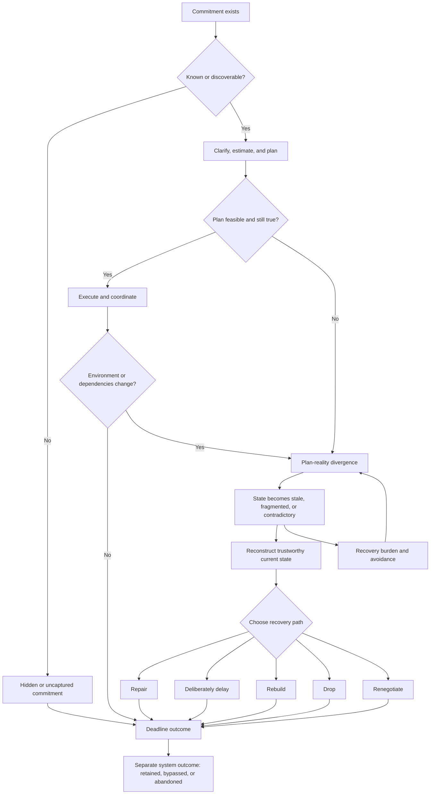

# Domain Understanding

## 1. Problem Space

This project operates in the space between planning and failure: the period when
a commitment still matters, but the plan for completing it no longer matches
reality.

People miss deadlines for many reasons. A commitment may never be captured. The
work may be vague, underestimated, or overcommitted from the beginning. A viable
plan may later be invalidated by a changed requirement, urgent work, a delayed
approval, or another person's dependency. Even when completion remains possible,
the information needed to continue may be scattered across messages, documents,
calendars, notes, meetings, and task systems.

At that point, remembering the deadline is not enough. The person must work out
what changed, where the work stopped, what remains valid, what is blocked, and
what can realistically happen next. The stored plan may have become stale,
fragmented, or contradictory. Reconstructing it competes with the work itself.

Productivity-system abandonment is related but distinct. A person may finish the
task while abandoning the tool, or keep using the tool while still missing the
task. Systems often become hardest to use after a disrupted week, an ignored
reminder, or a growing overdue backlog. The central domain question is therefore
not simply how to remind people or motivate them. It is how to preserve or
restore a valid, legible, and recoverable commitment state under changing
conditions.

## 2. What Existing Tools Tend To Optimize For

Productivity products usually specialize in one part of the deadline lifecycle.
Their strengths are real, but they do not automatically transfer to recovery
after the stored plan becomes unreliable.

| Product family | What it usually optimizes | Where the recovery gap can remain |
| --- | --- | --- |
| Capture tools | Recording tasks, notes, and incoming commitments | Captured items can become stale, hidden, duplicated, or detached from later context. |
| Reminder and to-do tools | Remembering, recurring alerts, and list completion | A reminder can retrieve the task name without explaining what changed or what to do next. |
| Calendar and time-blocking tools | Assigning work to time and protecting execution windows | Calendar placement assumes that task state, duration, priority, and availability are still trustworthy. |
| Auto-schedulers | Moving work around constraints and rescheduling unfinished tasks | Repeated rescheduling can preserve an obsolete task model or hide chronic infeasibility. |
| Project and task-management tools | Structured ownership, dependencies, status, and collaboration | Their value depends on accurate maintenance; shared state can still be consistently wrong. |
| AI assistants and summarization tools | Extracting, drafting, summarizing, and answering across language-heavy inputs | Individual capabilities do not necessarily form an evidence-grounded recovery workflow or a safe recovery decision. |

Adjacent products address daily planning rituals, task decomposition, unified
inboxes, focus protection, or activity measurement. These can reduce ambiguity,
fragmentation, or distraction before a slip. They remain useful parts of the
landscape rather than competitors that must be dismissed.

The careful gap statement is:

> Public evidence suggests that productivity products emphasize capture,
> planning, scheduling, reminding, summarization, and rescheduling more than the
> complete recovery moment after a plan becomes stale, fragmented, or
> contradictory.

This is a product and experience gap, not proof that no competitor has relevant
capabilities. Existing products already provide pieces of extraction,
summarization, workflow automation, scheduling, and action support.

## 3. User Pain Evidence

The user-evidence corpus produced recurring qualitative patterns. It was heavily
drawn from Reddit, reviews, Product Hunt, app stores, and Hacker News, so it
cannot establish population prevalence. It does reveal what failure feels like
to people who have tried to manage commitments with external systems.

The strongest patterns were:

1. **The stored plan becomes false.** Tasks, dates, priorities, and estimates
   remain in the system after circumstances change.
2. **Overdue backlogs become aversive.** A growing red list can feel punitive and
   make reopening the system harder.
3. **Re-entry requires cleanup before progress.** Users must interpret old tasks,
   remove obsolete items, recover context, and decide priorities again.
4. **Reminders can work technically while failing behaviorally.** The alert fires,
   is dismissed, and leaves the underlying commitment no more actionable.
5. **Commitments become hidden.** Important work may remain buried in email,
   messages, notes, meetings, or parallel shadow systems.
6. **Maintenance can exceed perceived value.** Systems that demand continuous
   tagging, estimation, categorization, and correction are often abandoned.
7. **Reliability determines trust.** Missing tasks, broken synchronization, and
   opaque automation push users toward paper, memory, or duplicated systems.

The resulting qualitative loop is:

> Reality diverges from the plan -> stored state becomes stale or punishing ->
> cleanup becomes costly -> avoidance becomes attractive -> divergence grows ->
> work is delayed, missed, adjusted, or the system is abandoned.

This loop is directional, not a universal causal law. Psychological research
strongly supports task avoidance after negative affect, ambiguity, and reduced
self-efficacy. Direct evidence that people avoid productivity systems
specifically because of cleanup burden remains more limited.

## 4. Why This Matters Now

For many knowledge-work and study contexts, commitments are created and modified
across email, chat, meetings, documents, calendars, LMS pages, notes, and project
tools. These channels do more than communicate existing work. They inject new
requests, approvals, follow-ups, changed requirements, and hidden obligations.

The important environmental variable is not average busyness alone. It is
volatility: how often new work or changed conditions invalidate a previously
reasonable plan. An interruption displaces execution. Invalidation changes the
assumptions, inputs, priority, ownership, or scope on which the plan depended.

Complex work is especially sensitive because resumption requires more context.
Meeting density can fragment execution time, while removing coordination can
create a different form of debt. Flexible and hybrid work can help or harm
depending on boundaries, infrastructure, and the ability to create temporal
structure. Students may face fragmented academic platforms and paid-work
competition. Professionals may face message, meeting, and approval density.
Entrepreneurs may face role multiplicity, external dependencies, and shifting
priorities.

The evidence does not show that work is universally worse now, nor does it prove
that fragmentation directly causes most missed deadlines. It does show that in
many environments, plans can become invalid faster than a person can manually
repair them. This increases the relevance of recovery without making recovery a
universal explanation.

## 5. Final Failure Model

Deadline failure is best modeled as a multi-path breakdown in maintaining a
valid, legible, and recoverable commitment state under changing conditions.

The major pathways are:

- **Non-capture or invisibility:** the commitment never enters a recoverable
  representation or remains hidden until too late.
- **Ambiguity, misestimation, or overcommitment:** the original plan is fragile
  or infeasible before execution begins.
- **Environmental invalidation:** requirements, priorities, meetings, or urgent
  work change after a viable plan is made.
- **Dependency failure:** ownership, handoffs, approvals, blockers, or escalation
  fail outside the individual's direct control.
- **State staleness and fragmentation:** the stored representation no longer
  agrees with current reality or with other artifacts.
- **Affective and cognitive recovery burden:** reconstruction requires working
  memory, interpretation, decisions, and emotional re-entry when capacity may be
  low.
- **Adaptive adjustment:** rebuilding, dropping, or renegotiating can be a
  rational outcome rather than a failure.
- **Outcome divergence:** task completion and productivity-system retention are
  separate results.

Post-slip reconstruction can require seven operations: detect divergence,
reconstruct where work stopped, determine what remains valid, suppress obsolete
cues, reconcile conflicting sources, reprioritize, and produce a locally
executable next action. A reminder can leave all seven undone.

Recovery remains only one branch. It cannot supply an absent dependency, make an
infeasible workload fit the remaining time, or recover evidence that never
existed. Restoring state makes an informed decision possible; it does not
guarantee execution or on-time completion.

## 6. Locked Thesis

> When a known or discoverable commitment remains actionable but its plan has
> become stale, fragmented, or contradictory after reality changes, recovery
> requires reconstructing a trustworthy current state and choosing whether to
> repair, deliberately delay, rebuild, drop, or renegotiate.

This is the final research conclusion after adversarial review. It defines a
bounded recovery problem rather than a universal theory of missed deadlines.

The five recovery paths matter because non-completion has different meanings.
Repair preserves the existing plan. Deliberate delay postpones the repair
decision while preserving legibility. Rebuild creates a new plan from current
conditions. Drop ends a commitment that is no longer worth pursuing. Renegotiate
changes the obligation with an affected person or institution. Treating every
case as "reschedule" or "try harder" would erase these distinctions.

## 7. Defensible Product Claim

> The product is designed to reduce recovery effort and improve decision clarity
> after plan-reality divergence.

This statement describes the intended mechanism, not a measured product effect.
Current evidence does not establish that an AI recovery system produces fewer
missed deadlines, faster completion, reduced stress, reduced late work, or lower
system abandonment. Those remain validation hypotheses.

The first measurable value should therefore be closer to the intervention:
whether a person can reconstruct a trustworthy current state with less time,
fewer omissions, and less correction work, and then make a valid recovery
decision. Deadline outcomes should be studied only after that mechanism works.

## 8. Target Topology

The product should be scoped by the structure of the commitment rather than by a
demographic or occupational label.

### Strong Fit

- The commitment is known or discoverable from existing artifacts.
- The stored plan no longer matches reality.
- State is stale, fragmented, contradictory, or expensive to interpret.
- The commitment remains actionable or meaningfully adjustable.
- The user has enough time and authority to choose or request a recovery path.
- Ordinary reminders and structured scheduling are insufficient.
- Evidence is language-heavy or distributed enough that manual reconciliation
  creates meaningful cost.

### Weak Fit

- The commitment was never captured and cannot be discovered.
- The task is fully structured in one reliable source.
- A reminder, checklist, or deterministic rule solves the failure.
- The workload is impossible regardless of recovery.
- An external dependency cannot be changed, escalated, or renegotiated.
- The user lacks authority to act or request a change.
- The task is already obsolete and requires only confirmation of abandonment.

Students, professionals, freelancers, founders, interns, caregivers, and other
individuals can encounter the strong-fit topology. A professional workflow may
contain rich fragmentation, while a professional's recurring bill may not. A
student group project may fit strongly, while a single assignment in one reliable
LMS may not. Persona affects examples, permissions, and stakes; it is not the
causal thesis.

## 9. AI, Software, And Human Boundary

The intervention must use each form of agency for the work it handles best.

| Responsibility | Appropriate role |
| --- | --- |
| AI | Extract candidate commitments from unstructured artifacts; compare sources; reconstruct where work stopped; summarize what changed; surface contradictions; label uncertainty; draft recovery options and candidate next actions. |
| Deterministic software | Handle reminders, recurrence, explicit rules, structured scheduling, checklists, forms, state transitions, and approval workflows. |
| Human | Confirm truth when sources conflict; determine goal value and final priority; choose repair, deliberate delay, rebuild, drop, or renegotiate; authorize external or consequential actions. |

AI should not silently decide which source is authoritative, infer why a person
is disengaging, decide that a goal should be abandoned, infer that an empty
calendar slot is available, or communicate a changed obligation without
approval. Access to an artifact does not imply authority to alter the commitment
it describes.

The AI intervention hypothesis applies only to messy, multi-source evidence. It
must beat both manual recovery and a well-designed deterministic workflow after
verification, correction, latency, privacy, and cost are counted.

## 10. Non-Negotiable Constraints

1. **Do not create another stale planning layer.** Avoid duplicate plan
   maintenance and independently drifting copies of commitment state.
2. **Ground inferred state in evidence.** Keep sources, timestamps, uncertainty,
   assumptions, and contradictions visible.
3. **Make state expire and remain contestable.** Inferred commitments must be
   correctable, dismissible, versioned, and reversible.
4. **Minimize data access.** Use only the artifacts needed for the requested
   recovery. Automatic derivation is not permission for surveillance.
5. **Default to explicit low-friction invocation.** Forwarding an email,
   uploading a screenshot, pasting a messy note, or selecting artifacts are
   hypotheses for invoking recovery without maintaining another inbox.
6. **Keep proactive monitoring optional and consented.** Background access is not
   assumed and must justify false-alert, privacy, and nagging costs.
7. **Do not infer mental state or goal value.** Ask rather than diagnose whether
   the person is avoiding, blocked, or rationally disengaging.
8. **Separate access from authority.** Reading a shared artifact does not permit
   changing ownership, deadlines, or another person's obligations.
9. **Require approval for consequential actions.** Messages, shared-calendar
   changes, commitment deletion, renegotiation, escalation, and ownership changes
   remain human-authorized.
10. **Do not infer availability from absence.** A blank calendar slot is not
    automatically free time.
11. **Treat content as untrusted input.** Email, documents, chat, LMS pages, and
    web content can contain malicious or misleading instructions.
12. **Build trust through inspectability.** Use provenance, uncertainty, action
    previews, approval, logs, and rollback rather than exposing hidden
    chain-of-thought.
13. **Keep correction cheaper than manual recovery.** If verification recreates
    the original burden, the intervention has failed.

## 11. Validation Implications

The first evaluation must compare the same disrupted, multi-artifact scenarios
under three conditions:

| Baseline | Purpose |
| --- | --- |
| Manual recovery | Establish the natural reconstruction time, omissions, and decision burden. |
| Deterministic recovery workflow | Test whether search, filters, templates, rules, and structured integrations already solve the problem. |
| AI-assisted recovery | Measure incremental value after factual errors and correction work are included. |

Primary metrics are:

- time to a trustworthy current state;
- precision and recall of commitments, deadlines, blockers, and changed facts;
- source coverage and contradiction detection;
- omissions, false commitments, and stale conclusions;
- correction and verification burden;
- quality and appropriateness of recovery options;
- time to the first valid recovery action;
- whether a recovery decision is initiated;
- trust, overreliance, rejection, and abandonment.

Invocation must be tested separately. Explicit one-step sharing should be
compared with any consented proactive mode rather than assuming background
monitoring wins. Safety tests should include missing evidence, conflicting
sources, obsolete artifacts, malicious instructions, and unclear authority.

Claims such as "45 minutes to 2 minutes" are demo hypotheses until measured.
Longitudinal outcomes such as fewer late tasks, fewer missed deadlines, reduced
stress, or lower abandonment should be evaluated only after the reconstruction
mechanism demonstrates value.

The intervention should be rejected or redesigned if deterministic software
performs similarly with lower risk, if source coverage is insufficient, if users
do not invoke it when overloaded, if verification costs erase the benefit, or if
clarity does not lead to a valid decision or action.

## 12. What This Means For Product Definition

Research has established a bounded problem thesis and a testable intervention
hypothesis. It has not selected the product.

The next artifact must choose:

- the exact strong-fit deadline topology;
- the primary individual audience and hero broken-plan scenario;
- the smallest complete recovery workflow;
- the measurable recovery outcome;
- the MVP boundary and explicit non-goals;
- the validation scenarios and baselines.

A personal professional workflow is a strong candidate because email, calendar,
documents, meeting notes, and changing requirements can make the target topology
visible without requiring a team-management product. A student or founder
scenario may express the same topology. That choice belongs to Product
Definition, where evidence fit, accessibility, privacy, setup burden, and
demonstration clarity can be compared directly.

No feature list, interface, architecture, technology choice, or demonstration
script is implied by this document.
