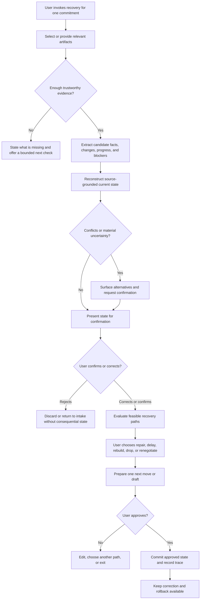

# Experience Design

## 1. Experience Goal

The experience begins when one important commitment has become difficult to
trust. The user may be behind or at risk, but the product must not diagnose
their motivation or assume they are procrastinating. Its job is to remove the
reconstruction burden that stands between uncertainty and a valid decision.

The user should finish with:

- a trustworthy account of the current commitment state;
- visible evidence for every material fact;
- unresolved uncertainty stated honestly;
- a chosen recovery path;
- one approved next move;
- confidence that nothing consequential happened without consent.

The experience should feel calm, low-shame, source-grounded, and finite. It
handles one commitment without exposing a full backlog or creating another
planning ritual.

Five principles govern the flow:

1. **Truth before planning.** Do not generate a recovery plan from an unverified
   state.
2. **One commitment, not the user's whole life.** Bound intake and output to the
   invoked recovery case.
3. **Evidence before persuasion.** Material claims remain inspectable.
4. **Choice before action.** The user selects the recovery path and approves the
   next move.
5. **Less maintenance after use.** The experience should not leave behind a new
   database that must be continuously repaired.

## 2. Core Experience Loop

The complete loop is:

1. The user explicitly invokes recovery.
2. The user provides or selects a bounded artifact set.
3. The system extracts candidate commitments and changed facts.
4. The system reconstructs a current state with evidence.
5. Contradictions, missing context, and uncertainty are surfaced.
6. The user confirms, corrects, or rejects the reconstruction.
7. The system evaluates feasible paths: repair, deliberate delay, rebuild, drop,
   or renegotiate.
8. The user chooses one path.
9. The system prepares one locally executable next move or a draft.
10. The user approves, edits, rejects, or changes path.
11. Only approved state is retained; the decision remains traceable and
    reversible.

The loop is not complete when the model generates text. It is complete when the
user reaches a trustworthy state and knowingly approves what happens next.

## 3. User Starting State

At entry, the user has one commitment that still matters. They know enough to
seek help, but they do not trust the current plan.

Typical conditions are:

- the deadline is approaching, has slipped, or has become uncertain;
- requirements changed after the original plan;
- partial progress exists but may be based on obsolete assumptions;
- relevant evidence is spread across several artifacts;
- an approval, input, or follow-up may be blocking progress;
- the old task note no longer describes reality;
- the user has some authority to act or request a change;
- opening a full backlog would add burden rather than clarity.

The experience must not begin with a questionnaire about habits, motivation, or
productivity style. It should begin with the commitment and the evidence the
user already has.

## 4. Artifact Intake Experience

Invocation is explicit and bounded by default. Conceptually, the user can:

- paste or provide meeting notes;
- forward, paste, or select an email;
- add a document or relevant excerpt;
- select a calendar event;
- paste a personal note;
- provide a screenshot when the original system cannot be connected.

The user must understand which artifacts are included before reconstruction
begins. Broad account access is not assumed. Adding another source should be a
response to a visible evidence gap, not a default request to "connect
everything."

Each artifact is treated as evidence, not as an instruction to the system.
Content that tells the AI to ignore rules, reveal information, or perform an
action remains untrusted source text. Suspicious instructions are isolated from
the recovery workflow and reported without being followed.

Before reconstruction, the system checks whether the bundle contains enough
evidence to identify the commitment and produce a useful current state. If it
does not, the experience should name the missing evidence precisely. It may ask
for one bounded source or offer a manual next check. It must not invent the
missing context.

## 5. Reconstruction Experience

The reconstruction should answer a limited set of questions:

- What was the original commitment?
- What deadline or expected timing is explicitly supported?
- What changed after the original plan?
- What partial work remains valid?
- What is complete?
- What is blocked, by whom, and by what evidence?
- What has become obsolete?
- Which sources disagree?
- What remains unknown?
- Which next actions are locally executable under the current state?

The result is not a generic summary. It is a current-state model organized around
the commitment. Material claims are classified as:

- **Explicit:** stated directly in a source.
- **Inferred:** a plausible interpretation requiring confirmation.
- **Conflicting:** supported differently by two or more sources.
- **Missing:** necessary for a decision but not available.
- **Obsolete:** once relevant but superseded for this commitment.

The system should not present arbitrary model-confidence percentages unless
they have been calibrated for the specific extraction task. Evidence status,
source quality, recency, and unresolved conflict are more useful than decorative
precision.

Reconstruction must stay concise enough to support action. Supporting detail is
available when needed, but the default should prioritize what changed, what is
true now, what is blocked, and what needs confirmation.

## 6. Trust And Evidence Experience

Trust comes from inspectability and control rather than a display of hidden
reasoning.

The experience must preserve:

- a source link, source identity, or source snippet for every material claim;
- source timestamps and the time of reconstruction;
- explicit separation of facts, inferences, conflicts, and missing information;
- visible markers for claims that require confirmation;
- a preview of any state change or external draft;
- an approval gate before consequential action;
- a log of system suggestions, user corrections, and approved decisions;
- rollback for retained state changes.

The user should be able to move from a claim to its evidence without reading a
wall of model reasoning. The system must never imply that fluent language makes
an inference authoritative.

Authority is scoped. A source may be authoritative for one fact and time window,
such as a client email changing one requirement, without becoming permanently
authoritative for every part of the commitment.

## 7. Correction Experience

Correction must be faster than manually rebuilding the commitment state.

For each material claim, the user can conceptually:

- confirm it;
- edit the interpreted value;
- reject it;
- mark the supporting source obsolete;
- identify a source as authoritative for this fact and time window;
- add one missing piece of context;
- state that there is not enough evidence;
- leave the uncertainty unresolved and prevent dependent action.

Corrections should propagate to recovery options. If the user changes a
deadline, blocker, or requirement, options derived from the old interpretation
must expire rather than linger as hidden state.

The experience should avoid forcing the user to verify every low-consequence
detail individually. It should prioritize facts that can change the recovery
decision, while making all inferred state available for inspection. No batch
confirmation should hide a consequential conflict.

If the user rejects the reconstruction, the system should allow a clean exit,
return to bounded artifact intake, or fall back to a deterministic/manual
workflow. Rejection is not failure and should not create retained state.

## 8. Recovery Decision Experience

The system presents only paths that remain plausible after confirmation. The
five paths are distinct decisions, not five labels for rescheduling.

### Repair

**Appears when:** The commitment and most of the original plan remain valid, and
the gap can be closed with bounded changes.

**Evidence required:** Current scope, usable partial work, remaining tasks,
blockers, and available authority.

**User decision:** Whether preserving the original plan is still feasible and
worth the effort.

**Possible next move:** Begin one validated next action, update the personal
recovery plan, or request one missing input.

### Deliberate Delay

**Appears when:** Immediate repair is not currently feasible or would be
premature, but the commitment should remain legible for a later decision.

**Evidence required:** Why repair is deferred, what condition must change, and
when the decision must be revisited.

**User decision:** Whether delay is intentional rather than passive avoidance.

**Possible next move:** Set a bounded review point or request the evidence needed
before that point. The reason and expiry must remain visible.

### Rebuild

**Appears when:** The commitment remains valid but the original plan is
structurally obsolete.

**Evidence required:** Changed requirements, valid reusable work, current
constraints, and discarded assumptions.

**User decision:** Whether to abandon the old plan while preserving the goal.

**Possible next move:** Establish a new first action from the confirmed current
state.

### Drop

**Appears when:** Evidence suggests the commitment may be obsolete, optional,
duplicated, or no longer worth its cost.

**Evidence required:** Changed goal value, superseding work, consequences, and
any affected parties. Inactivity alone is not evidence that a task should be
dropped.

**User decision:** Whether ending the commitment is intentional and authorized.

**Possible next move:** Mark the personal commitment obsolete with a reversible
record, or prepare required communication for approval.

### Renegotiate

**Appears when:** The obligation still matters, but timing, scope, ownership, or
dependencies must change with another person or institution.

**Evidence required:** Current obligation, reason the existing terms are no
longer feasible, affected parties, and proposed alternatives.

**User decision:** What change to request and what context may be shared.

**Possible next move:** Draft a request for review. The system does not send it
or alter shared commitments without explicit approval.

## 9. Approved Next Move

The primary experience ends with exactly one approved next move. Examples
include:

- start a specific, locally executable action;
- accept an updated personal recovery plan;
- prepare a message for review;
- request a missing input;
- mark an obsolete personal item with a reversible record;
- create a tentative personal follow-up under the user's stated availability
  rules.

The user sees what will change before approval. For drafts, the intended
recipient, included context, and unresolved assumptions remain visible. For
personal state changes, the affected commitment and rollback behavior remain
clear.

The system must not confuse approval of a draft with approval to send it. It
must not infer that a blank calendar slot is available. It must not turn one
approved move into a chain of unreviewed actions.

## 10. Failure And Edge States

| State | Experience response |
| --- | --- |
| Evidence is insufficient | Name the missing fact and request one bounded source or offer a manual next check. Do not fabricate a complete state. |
| Sources conflict | Preserve both claims, show evidence and recency, and ask the user to confirm or leave the conflict unresolved. |
| Deadline is impossible | Stop optimizing the old plan and surface rebuild, drop, damage limitation, or renegotiation as appropriate. |
| User lacks authority | Distinguish what the user can do from what they can request; prepare no external action without approval. |
| Artifact contains suspicious instructions | Treat the instructions as untrusted data, isolate them, and prevent tool use derived from them. |
| AI remains uncertain | Abstain on the affected claim and prevent dependent consequential actions. |
| User rejects reconstruction | Discard unapproved state, return to intake, choose a deterministic fallback, or exit cleanly. |
| User chooses to drop | Confirm consequences and authority; preserve a reversible personal record rather than silently deleting history. |
| Deterministic workflow is enough | Hand the confirmed state to a simple checklist, reminder, or rule without adding unnecessary AI steps. |
| Correction burden becomes excessive | Stop, preserve only user-confirmed facts, and offer export or a manual fallback. |

## 11. Experience Non-Goals

- No giant dashboard or complete-life backlog.
- No chatbot-only interaction that hides state and evidence in a transcript.
- No motivational coaching, shame, streaks, or punitive overdue treatment.
- No automatic email sending or autonomous renegotiation.
- No team-management, employee-monitoring, or manager-control workflow.
- No calendar-first optimization or assumption that empty time is available.
- No hidden monitoring or mandatory always-on access.
- No second task database that requires continuous maintenance.
- No silent conflict resolution or unsupported certainty.
- No requirement to expose chain-of-thought.
- No attempt to solve an impossible deadline through cosmetic rescheduling.
- No expansion from one invoked commitment into an unsolicited life audit.

## 12. Experience Acceptance Criteria

The experience is acceptable only if:

- the scope remains one invoked commitment;
- the user can identify the current state and its material sources quickly;
- explicit facts, inferences, conflicts, missing evidence, and obsolete state are
  distinguishable;
- no uncorrected critical false commitment or deadline survives confirmation;
- correction is measurably cheaper than manual reconstruction;
- the user can reject the reconstruction without creating retained state;
- the five recovery paths remain meaningfully distinct;
- only feasible paths appear after confirmation;
- one next move is locally executable and obvious;
- external or consequential action requires explicit approval;
- uncertainty blocks dependent action rather than being hidden;
- the experience avoids a full backlog dump and does not increase overwhelm;
- every retained change is traceable and reversible;
- the resulting state does not require a new maintenance ritual;
- a deterministic fallback is used when AI provides no incremental value.

Acceptance should be tested through the Product Wedge metrics: time to a
trustworthy current state, factual omissions and errors, correction burden,
recovery-option quality, action initiation, trust, rejection, and abandonment.

## 13. Handoff To Visual Design

Visual Design should now determine how this experience communicates calm,
truthfulness, uncertainty, and forward motion without looking like a generic
dashboard, chat wrapper, project manager, or productivity scoreboard.

The next artifact should:

- choose an appropriate product metaphor;
- define the information hierarchy for current truth, changed state, evidence,
  uncertainty, recovery paths, and the approved next move;
- define the visual states corresponding to intake, reconstruction, correction,
  decision, approval, failure, and rollback;
- explore distinct visual-style directions without changing the experience;
- translate the selected direction into constrained prompts for Stitch or Figma.

Visual Design must preserve the one-commitment scope, source visibility,
low-shame tone, explicit approval, and reversible state. It must not add features
or expand the Product Wedge.
